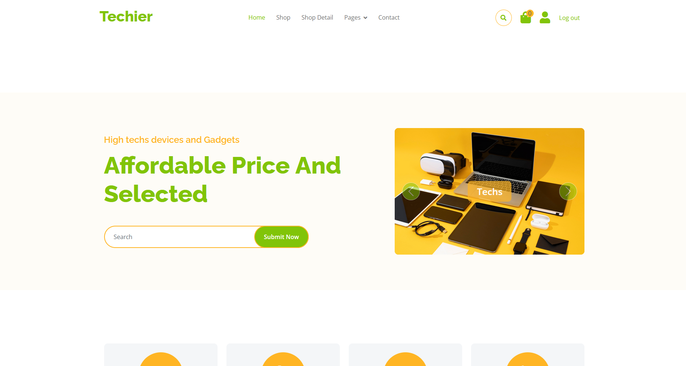
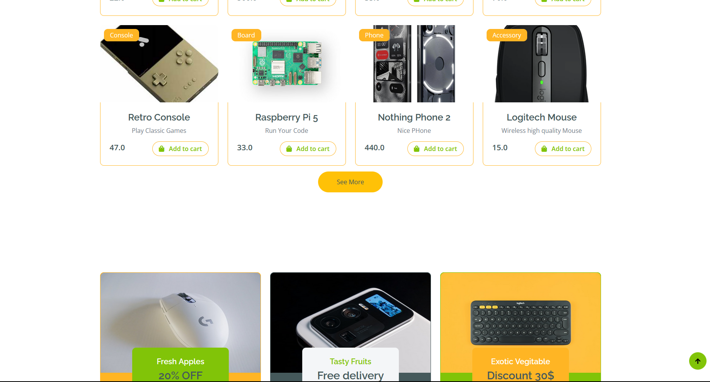

FlaskEcommerce

FlaskEcommerce is a simple e-commerce web application built using Flask. It allows users to browse products, add them to the cart, manage purchases, and process payments using Stripe. It also includes an admin panel for product management.
Features

    User Authentication: Sign up, log in, and manage user profiles.

    Product Management: Add, edit, delete, and display products.

    Shopping Cart: Users can add/remove products from their cart.

    Order Management: Admin can update order statuses (Pending, Shipped, Delivered, etc.).

    Payment Integration: Stripe test mode is implemented for checkout.

    Admin Dashboard: A restricted dashboard to manage products and orders.

    Database Management: Uses Flask-SQLAlchemy with three tables (Users, Products, Purchases).

    Bootstrap UI: Basic front-end styling using Bootstrap 5.

## Screenshot



Areas for Improvement:

    Add Categories & Filters: Implement product categories and search filters for better user experience.

    Enhance UI: Improve the front-end design to be more responsive and visually appealing.


## Installation  

1. Clone the repository:  
   ```sh
   git clone https://github.com/amorproje/AI-Reminder-App.git
   cd YOUR_REPO


